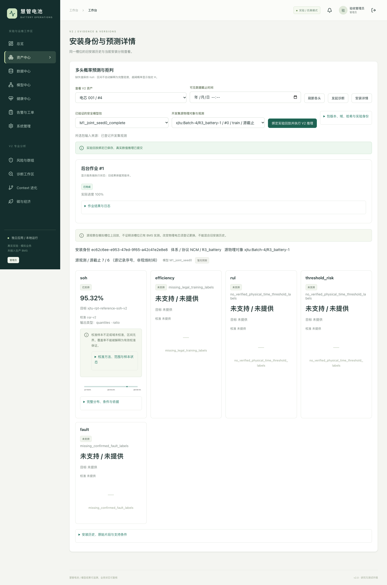
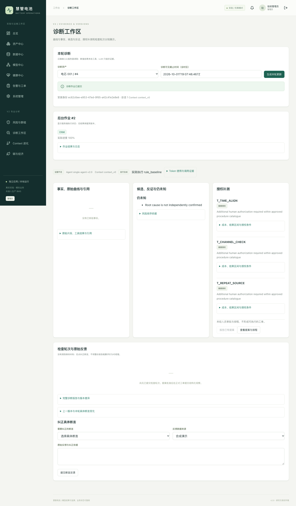

# V2 最终交付与验收

日期：2026-10-02。实现分支为 `DEV`，原始基线为 `c4203014c4c6999c2d176b1402d596813a072f73`。
本次由多个开发 Agent 协作；产品运行仍是单个固定流程 Agent。用户明确授权本团队合成内容、
通过测试云 API 实验、分阶段提交和上传 GitHub，覆盖需求原文中“用户自行合成”的分工。
每次提交的操作与验证见 [实施总记录](V2_IMPLEMENTATION_LOG.md)，模块各有独立说明。

## 已交付内容

| 工作包 | 实际交付 | 独立依据 |
| --- | --- | --- |
| 数据与数值模型 | XJTU/MATR/DyAD/CH 来源登记、对象级隔离、M1/M2三种子与消融、概率/生存/校准契约、六个可重载安全包 | [模型实施](../model_lab/docs/V2_IMPLEMENTATION.md)、[来源交付](../model_lab/reports/v2/sources/DELIVERY.md) |
| Skill 与合成数据 | 16 Skill、64冷启动示例、2400根情景、授权逐轮回放、40派单/30碳数学fixture | [内容实施](V2_CONTENT_IMPLEMENTATION.md)、[Skill明细](V2_SKILLS_DETAIL.md)、[fixture明细](V2_FIXTURES_DETAIL.md) |
| 云端单 Agent | OpenAI兼容服务端客户端、引用/数值/时间/安装验证、工具权限、有依据VOI与明确启发式回退 | [Agent实施](V2_AGENT_IMPLEMENTATION.md) |
| 自动 Context 进化 | ACE局部更新、GEPA独立dev选择、自动回归/恢复、版本CAS、取消/失败费用保留、正反例配额 | [最终接入核验](V2_AGENT_FINAL_REVIEW.md)、[原冻结云实验](V2_AGENT_EXPERIMENT.md) |
| 现场/群组/排程 | 原始反馈与观察版本、MAD残差/同工况相关、提案审批、资格约束CP-SAT、人工确认分配 | [后端](../battery_platform/docs/V2_BACKEND_IMPLEMENTATION.md)、[排程](../battery_platform/docs/V2_DISPATCH_IMPLEMENTATION.md) |
| 独立碳与经济 | 因子/状态/活动清单、鲁棒预算、Pareto、NPV、经营/影子/资格现金分账、不可变台账 | [Carbon](../battery_platform/docs/V2_CARBON_IMPLEMENTATION.md) |
| Web/小程序 | 保留V1七区，新增专业工作区；原生七页测试工程、签名扫码、离线队列、幂等与另一身份验收 | [Web](V2_WEB_IMPLEMENTATION.md)、[小程序](../battery_platform/docs/V2_MINIPROGRAM_IMPLEMENTATION.md) |
| 可复现运行 | UV锁文件、冻结安装/构建/启动/测试脚本、迁移备份/回滚、无本机数据的Git归档验收 | [运行手册](V2_RUNBOOK.md)、根 README |

## 最终实际验证

| 执行 | 结果 | 证据边界 |
| --- | --- | --- |
| `env BATTERY_LLM_API_KEY= .venv/bin/python -m pytest -q` | **517 passed in 67.37s** | 全根离线回归，包含原V1、真实API/worker、数学、来源、上下文与隔离检查；不调用云端 |
| `npm run build`（frontend） | TypeScript/Vite通过，1604模块 | 构建产物446.43kB JS；不等于能力评估 |
| Chrome完整 `v2.contract.spec.ts` | **13 passed (6.7s)** | 受控响应的界面/权限/版本/390px布局合同 |
| Chrome `v2.integration.spec.ts` | **1 passed (13.2s)** | 不拦截API，实际安全包推理与诊断；临时库、rule_baseline |
| 新包/输入/周期定向回归 | **14 passed in 3.61s** | 含真实MATR与多源包API/模型/Agent；研究回放，不是生产BMS |
| 小程序 `npm test` / `npm run check` | 11行为用例、7页面、59绑定通过 | 原生微信编译未运行；不冒充真机验收 |
| `uv sync --frozen --check` | 88已安装包，无需变更 | 已存在UV环境检查；首次实际安装记录在前述提交日志 |
| `verify_v2_checkout.py` | 六包完整输出按1e-7重放；真实API **3 passed, 6 deselected in 3.42s** | 归档提交 `cc8eb1ab8ef3be4a8428866a1e9a509b1ff7f469`，仅复用已安装依赖 |

[机器可读最终验证](../battery_platform/reports/v2_integration/final_validation.json) 记录本轮命令与结果。
[Git归档证据](../battery_platform/reports/v2_integration/committed_checkout.json) 验证的是已提交代码、
模型、开发输入；归档不复制本机 `.env`、runtime、MATR原始包或final，临时目录已删除。
六包共54份保存输出逐项核对，包括明确unsupported输出；不能把“可重载”当作“准确/可部署”。

此前真实 DeepSeek API 与 A0–A4 试验仍独立保存：平台HTTP提交202/读取200、有云报告且批准前正式工单为零；
完整pilot共177实际请求/1,887,590提供方tokens（含取消的旧试验）。合成内容另有28次/45,408tokens。
这些不同任务的账不混用；本轮接入修复及最终离线验收没有新增云端调用或重评sealed。

## 真实界面证据

以下来自本轮不拦截API的Chrome闭环，使用临时演示资产与真实XJTU安全包。来源明确为实验回放，
SOH显示实际95.32%，其他头保留unsupported，校准不足提示无界；诊断显示rule_baseline与证据不足。
图片已目视检查，没有云端凭据。

## 必须保留的研究与外部验收限制

- 多源MATR final实测M2存在负迁移，不能按“更复杂”强制部署；负结果、消融、旧诊断和首次冻结final均留存。
- 新MATR寿命研究仅6个共同支持policy、8个dev电芯；1精确/7右删失，C-index没有合法对为null，
  寿命未校准，SOH CQR样本不足无界，效率/故障unsupported。两新增包 validated_deployment=false。
- CH来源是公开生成数据、母本未提供，部分划分缺类；DyAD标签属于车辆异常，不当电芯根因。
  来源许可与资格分别记录；8.27GB corrected MAT等原始包和final特征留在本机，不上传Git。
- 冻结云pilot中A4 sealed 0.3111低于静态v0的0.7000；保留契约误拒、预算阻断及费用，
  后置词法/回放/预算修复不回填旧评分。没有证明自进化泛化改善，专业语义盲评与真实现场验证未完成。
- 微信原生编译、真机扫码/断网联调及视频仍受本机缺少开发者工具、有效AppID和手机HTTPS环境限制。
  已交付测试工程与探针，不虚构这些外部结果，也不绕过微信网络校验。

## 提交索引

| 阶段 | Commit | 内容 |
| --- | --- | --- |
| 01 | a3a50665 | DEV授权范围与UV项目 |
| 02 | 5aaee397 | 锁定运行时与事务迁移 |
| 03 | ad837321 | 独立Carbon |
| 04 | 1bcadd66 | 约束排程 |
| 05 | 69b7a548 | 2400情景与16 Skill |
| 06 | 14ce6b8d | 原生小程序测试工程 |
| 07 | 0addea66 | 单Agent与Context核心 |
| 08 | 4286c158 | Carbon更换/基线边界 |
| 09 | c872356a | UV与V1冻结模型兼容 |
| 10 | a54e67be | Web与真实数值联通 |
| 11 | 73ce2cd8 | GEPA真实选择服务 |
| 12 | a13d1a27 | 回归底线与失败费用 |
| 13 | 7ac492c8 | 后端闭环与系统验收 |
| 14 | ce4f87fc | 多源研究与四安全包 |
| 15 | 6f9a9274 | 冻结真实云对照 |
| 16 | 45def812 | 通用数字词法修复 |
| 17 | 956e5b59 | 三批MATR续测与两寿命研究包 |
| 18 | cc8eb1ab | 自动回归/数值群组/按包输入最终链 |
| 19 | 40a149aa | 运行文档、Git归档验收与最终回执 |
| 20 | 本提交 | [实际GitHub上传回执](V2_PUBLISH_RECEIPT.md) |

索引以仓库Git记录为准。旧运行脚本现在读取根 `.env` 并按仓库根解析相对路径；无配置时保留原V1
默认目录，因此主流程统一使用 `scripts/v2.sh`。测试凭据只保存在忽略的本机配置，不进入Git上传。
